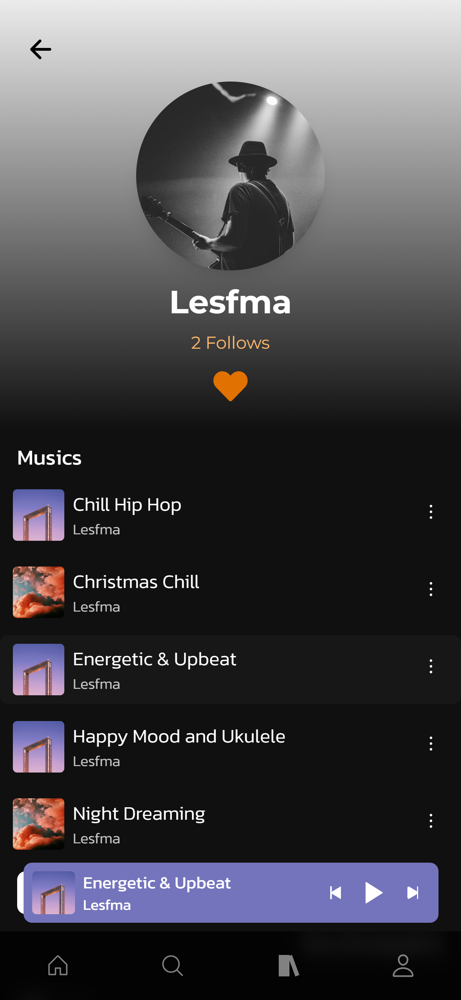
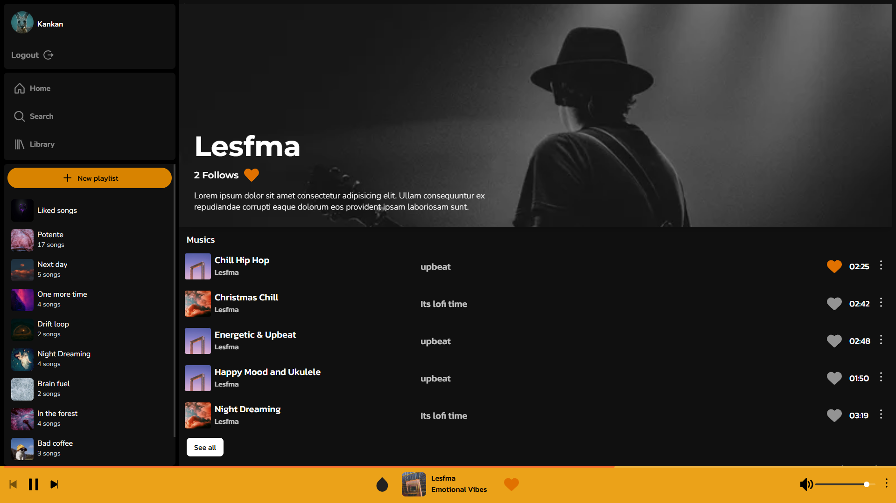
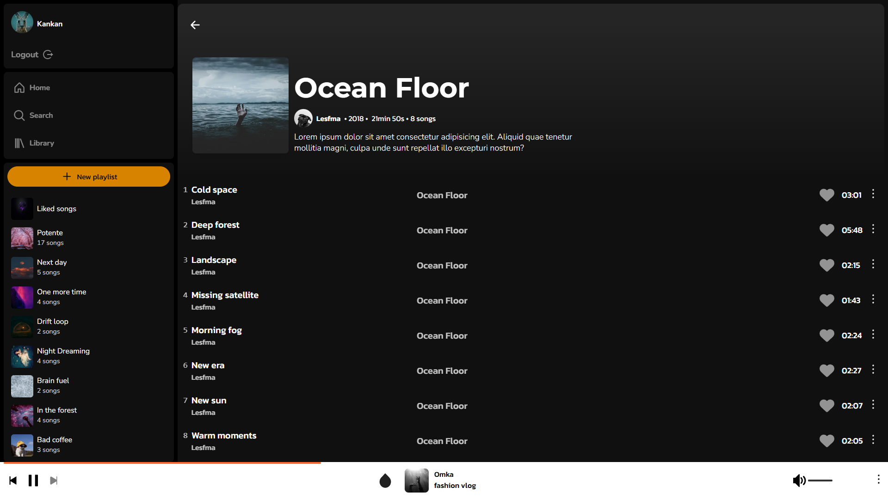
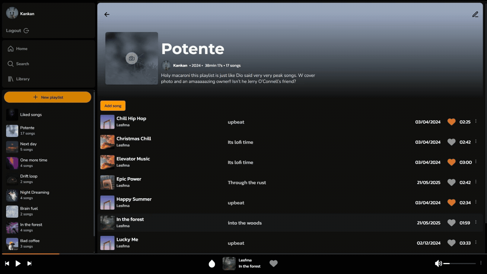

# zTunes

A music interactive website that allows users to control music playback, create playlists, access information about artists and albums, and discover new music through personalized recommendations. Additionally, we offer artists the opportunity to manage their own songs and profiles, with privileged accounts for artists and administrators for specific functions.

## Table of contents

- [Technologies Used](#technologies-used)
- [Screenshots](#screenshots)
- [Utilities](#utilities)
- [Custom Hooks](#custom-hooks)
- [Setup](#setup)

## Technologies Used

- Nextjs 15
- NextAuth
- MongoDb
- Typescript
- Jest (for unit tests)

## Screenshots

Mobile

<div style="display:flex;flex-wrap: wrap;gap:2px">
  
  
  
</div>

Desktop





## Utilities

### getVibrantColor

Extracts the most vibrant color from a given image URL. This is used for dynamic theming, like setting a background color that matches an album cover or user avatar.

```tsx
// Usage example

import getVibrantColor from "@/utils/getVibrantColor";
import { useEffect, useState } from "react";

function Component({ img }: { img: string }) {
  const [vibrant, setVibrant] = useState<{ color: string; isLight: boolean }>();

  useEffect(() => {
    async function extractColor() {
      const vibrantColor = await getVibrantColor(img);
      setVibrant(vibrantColor);
    }
    extractColor();
  }, [img]);

  return (
    <div
      style={{
        background: vibrant?.color ?? "#fff",
        color: vibrant?.isLight ? "#000" : "#fff",
      }}
    >
      
      <p>This color theme is dynamically based on the image above!</p>
    </div>
  );
}
```

Demo



## Custom Hooks

### [useForm](https://github.com/yemishi/zTunes/blob/main/src/hooks/useForm/useForm.tsx)

This custom hook manages form state, input values, and validation. It returns an object with values, errors, and utilities for handling changes, setting values,
validating inputs, and resetting the form. You define your form schema using an object of fields, where each field can have custom rules like min, max, isEmail,
compareField, and more.

```tsx
// Usage example
import useForm from "@/hooks/useForm";

const initialFields = {
  email: { value: "", isEmail: true },
  password: { value: "", min: 6 },
  confirmPassword: { value: "", compareField: "password" },
};

export default function RegisterForm() {
  const { values, errors, onChange, validateAll, resetForm } = useForm(initialFields);

  const handleSubmit = (e: React.FormEvent) => {
    e.preventDefault();
    if (validateAll()) console.log("Submit values:", values);
  };

  return (
    <form onSubmit={handleSubmit}>
      <input name="email" value={values.email} onChange={onChange} />
      {errors.email && <span>{errors.email}</span>}

      <input name="password" value={values.password} onChange={onChange} />
      {errors.password && <span>{errors.password}</span>}

      <input name="confirmPassword" value={values.confirmPassword} onChange={onChange} />
      {errors.confirmPassword && <span>{errors.confirmPassword}</span>}

      <button type="submit">Register</button>
      <button type="button" onClick={resetForm}>
        Reset
      </button>
    </form>
  );
}
```

### [useScrollQuery](https://github.com/yemishi/zTunes/blob/main/src/hooks/useScrollQuery/useScrollQuery.tsx)

This custom Hook fetches data with pagination and returns all values fetched, typed with the specified type provided as a generic. It includes properties from useInfiniteQuery and a ref, which serves as the observer. When the ref comes into view, for default the hook automatically calls for the next page of data. Note: Ensure that the array of data is located at index 1 and includes an item named hasMore with a boolean value in the API response object.

```tsx
// Usage example
import useScrollQuery from "@/hooks";

export default function Component() {
  const { values, isLoading, isFetchingNextPage, hasNextPage, ref, isError } = useScrollQuery<{
    text: string;
    id: string;
  }>({ url: "/https://apiUrl", queryKey: ["exampleKey"] });

  if (isLoading) return <div>loading...</div>;
  if (isError) return <div>Error: Failed to load data</div>; // Error handling

  return (
    <div>
      {values.map(({ text, id }, index) => (
        <p key={`${id}_${index}`}>{text}</p>
      ))}
      {!isFetchingNextPage && hasNextPage && <div ref={ref} />}
    </div>
  );
}
```

### [usePlayer](https://github.com/yemishi/zTunes/blob/main/src/hooks/usePlayer/usePlayer.tsx)

This custom Hook manages audio playback using the HTMLAudioElement. It controls playing, pausing, skipping tracks, and volume. It also tracks the current song time and provides a ref for the <audio> element. The hook returns player state and utility functions, along with a PlayerControls component for rendering basic playback buttons. Note: This hook must be used inside the PlayerProvider context. Calling it outside of the context will result in errors or undefined behavior. Note: This hook does not bind inputs automatically you must wire up value and onChange.

```tsx
// Usage example

import usePlayer from "@/hooks";
import { formatDuration } from "@/utils/formatting";
export default function Component() {
  const { currentTime, audioRef, onend, PlayerControls, song } = usePlayer();
  const {
    artistName,
    name,
    track: { url, duration },
  } = song;

  return (
    <div>
      <div>
        <input value={currentTime} type="range" />
        <h1>{name}</h1>
        <h2>{artistName}</h2>
      </div>
      <span>{formatDuration(duration || 0, true)}</span>
      <PlayerControls />
      <audio ref={audioRef} src={url} onEnded={onend} />
    </div>
  );
}
```

### [useLike](https://github.com/yemishi/zTunes/blob/main/src/hooks/useLike/useLike.tsx)

A custom React hook that manages the like/unlike state for a song, scoped to the current user. Built with @tanstack/react-query, it provides an easy way to track and update whether a user has liked a particular song — with optimistic UI updates and automatic cache management. Note: The hook only runs if username is provided.

```tsx
// Usage example
import useLike from "@/hooks/useLike";

export default function LikeButton({ songId, username }: { songId: string; username?: string }) {
  const { isLiked, isLoading, toggleLike } = useLike(songId, username);

  return (
    <button disable={isLoading} onClick={toggleLike}>
      {isLiked ? "💔 Unlike" : "❤️ Like"}
    </button>
  );
}
```

## Setup

Follow the instruction bellow to config and run in your local ambient

### 1.Clone the repository

```bash
git clone https://github.com/yemishi/zTunes.git
```

### 2.Install dependencies

```bash
cd zTunes
npm install
```

### 3.Copy the example environment file

Copy the '.env.example' file to a new file named '.env':

```bash
cp .env.example .env
```

### 4.Fill in the API keys

Open the '.env' file in a text editor and fill in the necessary API keys with your own values. For example

```bash
NEXTAUTH_SECRET=your-secret
URL=https://your-domain.com

DATABASE_URL=https://your-domain.com
JWT_SECRET="your JWT secret"

FIREBASE_API_KEY= "your FIREBASE key"
FIREBASE_AUTH_DOMAIN ="your FIREBASE domain"

// The transporter is used to send a email to user recover the password
TRANSPORTER_EMAIL="your TRANSPORTER email",
TRANSPORTER_PASS="your TRANSPORTER password"
```

Make sure to replace all fields with your own info

### 5.Run the project

```bash
npm run dev
```

This will start the development server.You can access the project in your browser at http://localhost:3000.

### Important Notes

The .env file is used to store sensitive environment variables, such as API keys, access tokens, and secrets. Never share or publish your .env file with sensitive information.
