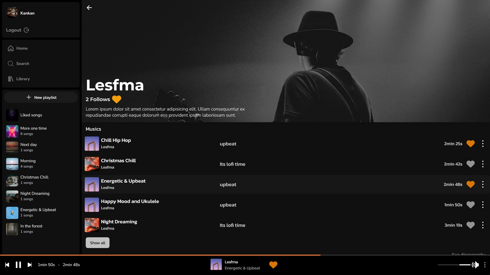
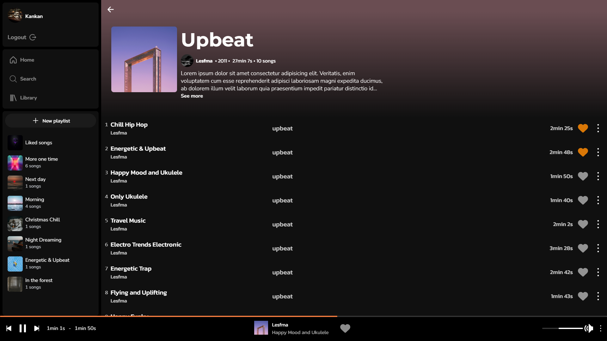

# zTunes
A music interactive website that allows users to control music playback, create playlists, access information about artists and albums, and discover new music through personalized recommendations. Additionally, we offer artists the opportunity to manage their own songs and profiles, with privileged accounts for artists and administrators for specific functions.

## Table of contents
- [Technologies Used](#technologies-used)
- [Custom Hooks](#custom-hooks)
- [Screenshots](#screenshots)
- [Setup](#setup)
  
## Technologies Used 
- Nextjs 14
- NextAuth
- MongoDb
- Typescript
- Jest (for unit tests)
- Zod (for data validation)

## Custom Hooks

### [useScrollQuery](https://github.com/yemishi/zTunes/blob/main/src/hooks/useScrollQuery.tsx)
This custom Hook fetches data with pagination and returns all values fetched, typed with the specified type provided as a generic. It includes properties for useInfiniteQuery and a ref, which serves as the observer. When the ref comes into view, the hook automatically calls for the next page of data. Note: Ensure that the array of data is located at index 1 and includes an item named hasMore with a boolean value in the API response object.

```tsx
// Usage example
import useScrollQuery from "/hooks";

export default function Component() {
  const { values, isLoading, isFetchingNextPage, hasNextPage, ref, isError } = useScrollQuery<{ text: string; id: string }>({ url: "/https://apiUrl", queryKey: ["exampleKey"] });

  if (isLoading) return <div>loading...</div>;
  if (isError) return <div>Error: Failed to load data</div>; // Error handling

  return (
    <div>
      {values.map(({ text, id }, index) => (
        <p key={`${id}_${index}`}>{text}</p>
      ))}
      {!isFetchingNextPage && hasNextPage && <div ref={ref} />}
    </div>
  );
}
```
### [usePlayer](https://github.com/yemishi/zTunes/blob/main/src/hooks/usePlayer.tsx)
This custom hook receives a URL of an audio file as props and returns the formatted total duration of the audio.

```tsx
// Usage example
import usePlayer from "/hooks"

export default function Component() {
  const { currentTime, duration, audioRef, onend, PlayerControls, song } = usePlayer(); // Adiciona os parênteses para chamar a função usePlayer
  const { artistName, name, urlSong } = song;
  
  return (
    <div>
      <div>
        <h1>{name}</h1>
        <h2>{artistName}</h2>
        <span>{currentTime}</span>
      </div>
      <PlayerControls />
      <audio ref={audioRef} src={urlSong} onEnded={onend} />
    </div>
  );
}
```
### [useSongDuration](https://github.com/yemishi/zTunes/blob/main/src/hooks/useSongDuration.tsx)
This custom hook receives a URL of an audio file as props and returns the formatted total duration of the audio.

```tsx
// Usage example 
import useSongDuration from "/hooks"

export default function Component() {
  const duration = useSongDuration(urlSong);
  return <div>{duration}</div>;
}
```

### [useLike](https://github.com/yemishi/zTunes/blob/main/src/hooks/useLike.tsx)
This custom hook receives an ID of a song and returns an object with the user's like state and the toggle function. If the user is not logged in, they will be redirected to the login page.
  
  ```tsx
// Usage example
import useLike from "/hooks";

export default function Component() {
  const { isLoading, toggleLike, isLiked } = useLike();


  return (
    <button onClick={toggleLike}>
      {isLoading ? 'Loading...' : (isLiked ? 'Unlike' : 'Like')}
    </button>
  );
}
  ```

### [useObject](https://github.com/yemishi/zTunes/blob/main/src/hooks/useObject.tsx)
This custom hook returns an object with state, typed with the specified type provided as a generic or by props like initialState, and a function to update the object.

```tsx
// Usage example
import useObject from "/hooks"

export default function Component() {
  const { state: { title, count }, updateObject } = useObject<{ title: string, count: number }>();

  const increment = () => updateObject("count", count + 1);
  const decrement = () => updateObject("count", count - 1); 

  return (
    <div>
      <h1>{title}</h1>
      <input type="text" value={title} onChange={(e) => updateObject("title", e.target.value)} />
      <button onClick={increment}>+</button>
      <button onClick={decrement}>-</button> 
      <span>{count}</span>
    </div>
  );
}
```
## Screenshots

### Mobile
<div style="display:flex;">
  
    
  
</div>

### Desktop
  
  

## Setup 

Follow the intrutions bellow to config and run in your local ambient

### 1.Clone the repository

```bash
git clone https://github.com/yemishi/zTunes.git
```
### 2.Install dependencies

```bash
cd zTunes
git clone https://github.com/yemishi/zTunes.git
```
### 3.Copy the example environment file 
Copy the '.env.example' file to a new file named '.env':

```bash
cp .env.example .env
```
### 4.Fill in the API keys
Open the '.env' file in a text editor and fill in the necessary API keys with your own values. For example
```bash
NEXTAUTH_SECRET=your-secret
NEXTAUTH_URL=https://your-domain.com

DATABASE_URL=https://your-domain.com

JWT_SECRET="your JWT secret"

FIREBASE_API_KEY= "your FIREBASE key"
FIREBASE_AUTH_DOMAIN ="your FIREBASE domain"

URL=https://your-project-domain.com

// The transporter is used to send a email to user recover the password
TRANSPORTER_EMAIL="your TRANSPORTER email",
TRANSPORTER_PASS="your TRANSPORTER password"
```
Make sure to replace all fields with your own info

### 5.Run the project
```bash
npm run dev
```
This will start the development server.You can acess the project in your browser at http://localhost:3000.

### Important Notes
The .env file is used to store sensitive environment variables, such as API keys, access tokens, and secrets. Never share or publish your .env file with sensitive information.

